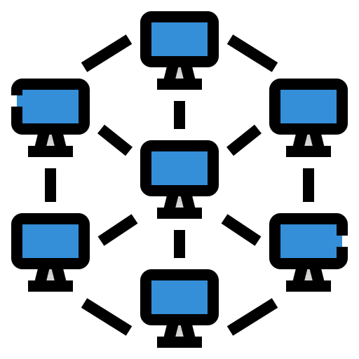

<h1 align="center"><b>Perfil GitHub.</b></h1>
<h1 align="center">👾 Quem sou eu?</h1>
<h2 align="justify">🖖 Eu sou o Bernardo Moreira 4.4. Acredito no aprendizado contínuo, Dito isto, não me canso de estudar e aprender a aprender.</h2>
<h2 align="justify">💻 Desde 2004 aprendendo a cada dia um pouquinho de Informática.</h2>
<h2 align="center"> 🚀 Microlins | SENAI | SENAC | FURUKAWA | MOTOROLA </h2>
<h2 align="center">⭐️ Tecnologias utilizadas. </h2>

    

        <h1 align="center"><b> 🎓 Formação acadêmica.</b></h1>
        <h1>Graduação pelo Instituto de Estudos Superiores da Amazônia - IESAM.</h1>
        
  

<h1>Tecnologia em Redes de Computadores.</h1>

  <h1> Pós Graduação pela Faculdade Iguaçú.</h1>
  
  
<h1>User Experience (UX) e User Interface (UI).</h1>

     

    <h1 align="justify"><b>☄️ Atualmente aprendo IA nos Bootcamps da Digital Innovation One.</b></h1>
    
    

     
    

         

  
  
